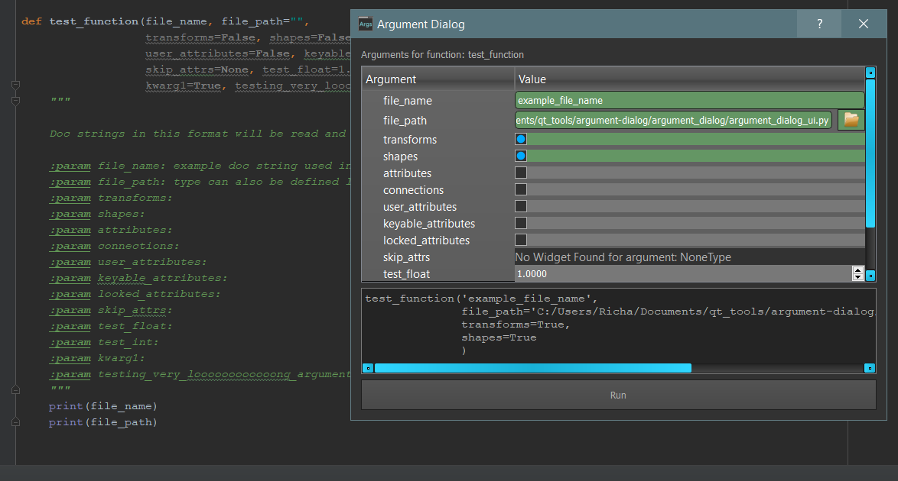

# argument-dialog
Automatic QT dialog for python functions.

This tool will analyze python function arguments and generate a UI for setting them in a function call.

Pressing "Run" will then execute the function with the specified arguments.

Was designed with one particular function in mind with lots of arguments. But could be useful for other things.

Special thanks to [Harald Zlattinger](https://github.com/HaraldZlattinger). This tool would not exist if he hadn't shown me the magic of unpacking dictionaries into kwargs.
